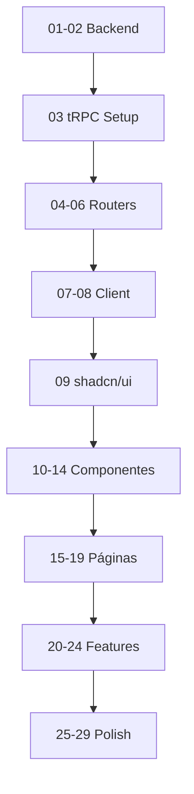

# Índice de Tarefas - Interface de Gestão de Dietas

## 📖 Como Usar Este Diretório

1. **Leia o README.md primeiro** - visão geral completa do projeto
2. **Execute as tarefas em ordem numérica** - respeitando dependências
3. **Marque ✅ cada tarefa concluída** abaixo
4. **Consulte `[CONSULTAR DOCUMENTAÇÃO]`** antes de implementar código

---

## 📋 Tarefas Detalhadas (Arquivos Markdown)

### Fase 1: Infraestrutura tRPC (01-08)

- [ ] `[01-criar-modelos-pydantic-meal-planning.md](01-criar-modelos-pydantic-meal-planning.md)`
  - Criar modelos Pydantic (MealPlanItem, MealInPlan, DietPlanWithMeals)
  - **Dependências:** Nenhuma
  - **Estimativa:** 1-2 horas

- [ ] `[02-criar-database-methods-foods-meals.md](02-criar-database-methods-foods-meals.md)`
  - Criar 7 métodos de database (search_foods, get_meal_plan_items, etc)
  - **Dependências:** Tarefa 01
  - **Estimativa:** 2-3 horas

- [ ] `[03-setup-trpc-server-infraestrutura.md](03-setup-trpc-server-infraestrutura.md)`
  - Setup tRPC (trpc.ts, context.ts, _app.ts)
  - **Dependências:** Nenhuma
  - **Estimativa:** 1 hora

- [ ] `[04-criar-trpc-router-foods.md](04-criar-trpc-router-foods.md)`
  - Router foods (search, getById, getPopular)
  - **Dependências:** Tarefas 02, 03
  - **Estimativa:** 1-2 horas

- [ ] `[05-criar-trpc-router-mealplans.md](05-criar-trpc-router-mealplans.md)`
  - Router mealPlans (getItems, calculateMacros, upsertItems, deleteItem, reorderItems)
  - **Dependências:** Tarefas 02, 03
  - **Estimativa:** 2-3 horas

- [ ] `[06-criar-trpc-router-intervention-plans.md](06-criar-trpc-router-intervention-plans.md)`
  - Router interventionPlans (CRUD completo + duplicate + close)
  - **Dependências:** Tarefas 02, 03
  - **Estimativa:** 3-4 horas

- [ ] `[07-configurar-trpc-client-nextjs.md](07-configurar-trpc-client-nextjs.md)`
  - Configurar tRPC client (lib/trpc.ts, TRPCProvider, layout.tsx)
  - **Dependências:** Tarefas 03-06
  - **Estimativa:** 1 hora

- [ ] `[08-criar-nextjs-api-route-trpc.md](08-criar-nextjs-api-route-trpc.md)`
  - API route handler (app/api/trpc/[trpc]/route.ts)
  - **Dependências:** Tarefas 03-07
  - **Estimativa:** 30min

**Subtotal Fase 1:** 11-16 horas

---

### Fase 2: Componentes shadcn/ui (09)

- [ ] `[09-instalar-componentes-shadcn-ui.md](09-instalar-componentes-shadcn-ui.md)`
  - Instalar 17 componentes via CLI
  - **Dependências:** Nenhuma
  - **Estimativa:** 1 hora

**Subtotal Fase 2:** 1 hora

---

### Fase 3: Componentes Core de Nutrição (10-14)

- [ ] `[10-criar-componente-food-search-combobox.md](10-criar-componente-food-search-combobox.md)`
  - Combobox com busca debounced e autocomplete
  - **Dependências:** Tarefas 04, 07, 09
  - **Estimativa:** 2-3 horas

- [ ] `[11-criar-componente-meal-item-row.md](11-criar-componente-meal-item-row.md)`
  - Row de item com edição inline de quantidade
  - **Dependências:** Tarefa 09
  - **Estimativa:** 1-2 horas

- [ ] `[12-criar-componente-meal-card.md](12-criar-componente-meal-card.md)`
  - Card de refeição com lista de items
  - **Dependências:** Tarefas 10, 11
  - **Estimativa:** 2-3 horas

- [ ] `[13-criar-componente-macros-summary.md](13-criar-componente-macros-summary.md)`
  - Dashboard comparativo com progress bars
  - **Dependências:** Tarefa 09
  - **Estimativa:** 1-2 horas

- [ ] `[14-criar-componente-diet-plan-metadata.md](14-criar-componente-diet-plan-metadata.md)`
  - Form de metadata com validação Zod
  - **Dependências:** Tarefa 09
  - **Estimativa:** 2-3 horas

**Subtotal Fase 3:** 8-13 horas

---

### Fase 4: Páginas da Aplicação (15-19)

**📌 Tarefas resumidas no README.md**

- [ ] **Tarefa 15:** Página `/dietas` (lista) - 2-3h
- [ ] **Tarefa 16:** Página `/dietas/novo` (criar) - 3-4h
- [ ] **Tarefa 17:** Página `/dietas/[id]` (visualizar) - 2-3h
- [ ] **Tarefa 18:** Página `/dietas/[id]/editar` (editar) - 3-4h
- [ ] **Tarefa 19:** Página `/dietas/historico` (histórico) - 2-3h

**Subtotal Fase 4:** 12-17 horas

---

### Fase 5: Features Avançadas (20-24)

**📌 Tarefas resumidas no README.md**

- [ ] **Tarefa 20:** Drag & Drop (dnd-kit) - 2-3h
- [ ] **Tarefa 21:** Templates de Refeições - 2-3h
- [ ] **Tarefa 22:** Copiar Refeições - 1h
- [ ] **Tarefa 23:** Validação em Tempo Real - 1-2h
- [ ] **Tarefa 24:** Gráficos Comparativos (recharts) - 2-3h

**Subtotal Fase 5:** 8-12 horas

---

### Fase 6: Polish & Testing (25-29)

**📌 Tarefas resumidas no README.md**

- [ ] **Tarefa 25:** Loading States e Optimistic Updates - 2h
- [ ] **Tarefa 26:** Error Handling Completo - 2h
- [ ] **Tarefa 27:** Responsive Design - 2-3h
- [ ] **Tarefa 28:** Melhorias de Acessibilidade - 2h
- [ ] **Tarefa 29:** Testes E2E (Playwright) - 3-4h

**Subtotal Fase 6:** 11-13 horas

---

## 📊 Resumo de Estimativas

| Fase | Tarefas | Horas Estimadas |
|------|---------|-----------------|
| Fase 1: Infraestrutura tRPC | 01-08 | 11-16h |
| Fase 2: shadcn/ui | 09 | 1h |
| Fase 3: Componentes Core | 10-14 | 8-13h |
| Fase 4: Páginas | 15-19 | 12-17h |
| Fase 5: Features Avançadas | 20-24 | 8-12h |
| Fase 6: Polish & Testing | 25-29 | 11-13h |
| **TOTAL** | **29 tarefas** | **51-72 horas** |

---

## 🔗 Dependências Críticas



**Regra de Ouro:** Não pule tarefas. Respeite a ordem.

---

## ✅ Progresso Global

**Tarefas Completas:** 0 / 29 (0%)

- Fase 1: ☐☐☐☐☐☐☐☐ (0/8)
- Fase 2: ☐ (0/1)
- Fase 3: ☐☐☐☐☐ (0/5)
- Fase 4: ☐☐☐☐☐ (0/5)
- Fase 5: ☐☐☐☐☐ (0/5)
- Fase 6: ☐☐☐☐☐ (0/5)

**Atualizar este índice ao completar cada tarefa!**

---

## 📝 Notas de Implementação

### Consulta de Documentação (CRÍTICO)

Sempre que ver `[CONSULTAR DOCUMENTAÇÃO: tópico]` nas tarefas:
1. **PAUSE a implementação**
2. Use ferramentas de busca (web, docs oficiais, MCP Context7)
3. Leia a documentação mais recente
4. **SOMENTE ENTÃO implemente** usando as práticas atualizadas

### Padrões de Código

- **TypeScript Strict Mode:** Sempre
- **React:** Functional components + hooks
- **Styling:** Tailwind CSS + shadcn/ui
- **Forms:** react-hook-form + Zod
- **Queries:** tRPC + React Query
- **State:** Local state first, context se necessário

### Commits

Fazer commit após cada tarefa concluída:
```bash
git add .
git commit -m "feat(nutrition): [NN] - Título da tarefa

- Subtarefa 1
- Subtarefa 2
- Subtarefa 3

Closes #NN"
```

---

## 🚀 Quick Start

```bash
# 1. Navegar para o diretório
cd /home/thiagosian/thiagosian-health/docs/dev/diet-management-interface

# 2. Ler o README
cat README.md

# 3. Começar pela Tarefa 01
cat 01-criar-modelos-pydantic-meal-planning.md

# 4. Implementar seguindo o template
#    - Objetivo
#    - Subtarefas (checklist)
#    - Consultar documentação necessária
#    - Implementação de referência
#    - Critérios de aceitação

# 5. Testar
# 6. Commit
# 7. Marcar como concluída no INDEX
# 8. Próxima tarefa
```

---

**Boa implementação! 🚀**
